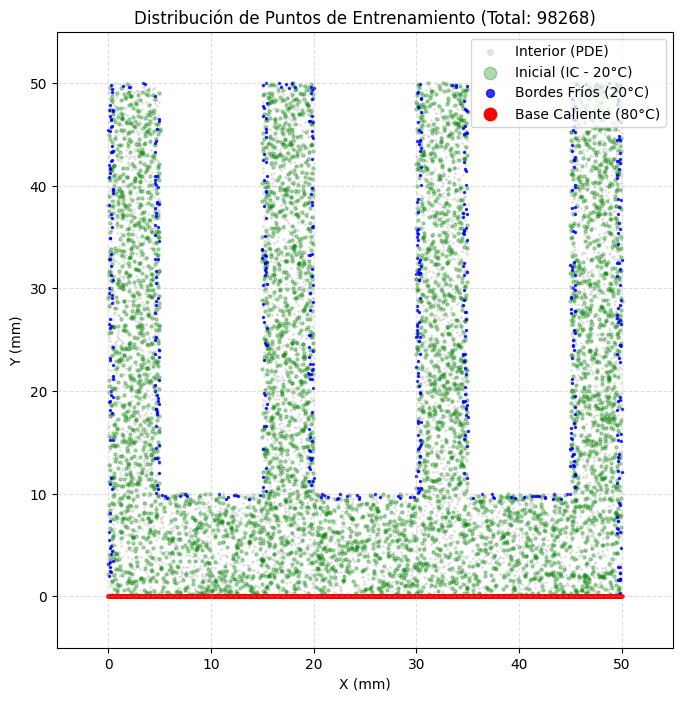
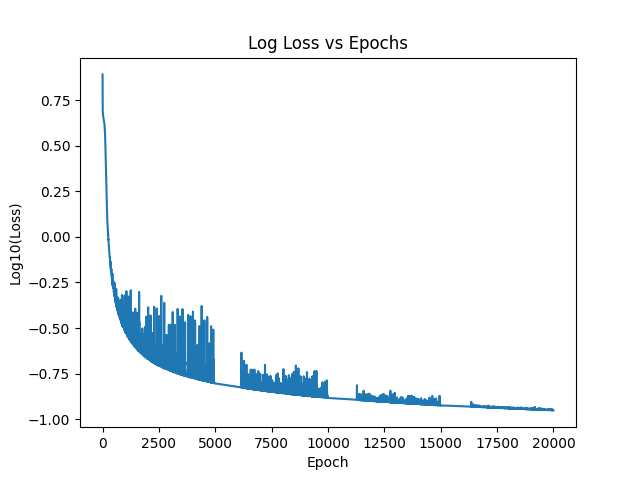

# Simulación de transferencia de calor en un disipador mediante Redes Neuronales Informadas por Física (PINN)

## Resumen del Proyecto
El presente trabajo aborda la solución de la ecuación de calor en una geometría compleja correspondiente a un disipador de aletas extruidas utilizando Redes Neuronales Informadas por Física (PINN). A diferencia de los métodos numéricos tradicionales, las PINNs no requieren de mallas para discretizar los datos, generando una solución continua y diferenciable que simplifica la resolución de problemas físicos al integrar las ecuaciones diferenciales directamente en la función de pérdida.

## Planteamiento Matemático
Se buscó resolver la ecuación de calor con la siguiente forma:
$$\frac{\partial u}{\partial t}=\alpha\nabla^{2}u$$

Donde $\alpha=97.4 \text{ mm}^{2}/s$ representa el valor de la difusividad térmica del aluminio. Las condiciones impuestas al modelo incluyen:
* **Condiciones de Frontera**: $u=80^{\circ}C$ en la base del disipador y $u=20^{\circ}C$ en el contorno restante, asumiendo un flujo de aire alto que iguala la temperatura de las paredes a la ambiental.
* **Condición Inicial**: $u_{0}=20^{\circ}C$ para todo el dominio en $t=0$.

## Implementación y Recursos de Cómputo
El entrenamiento se realizó utilizando el framework de **PyTorch**. Debido a la carga computacional que implica el cálculo de derivadas de segundo orden mediante diferenciación automática (`torch.autograd`) en un dominio de aproximadamente 100,000 puntos, se optó por un entrenamiento local:
* Se utilizaron las herramientas de **CUDA** para ejecutar el modelo en una unidad de procesamiento gráfico **NVIDIA GTX 1650**.
* Esta configuración fue necesaria debido a que la demanda de memoria y procesamiento para las 20,000 épocas de entrenamiento superaba las capacidades estándar de las herramientas basadas en la nube para este proyecto específico.

## Desarrollo Técnico

### Generación de Datos y Geometría
El dominio simula un corte transversal en 2D de un disipador con dimensiones de $50 \text{ mm} \times 50 \text{ mm}$, un grosor de base de $10 \text{ mm}$ y aletas de $5 \text{ mm}$.
* Se generaron 70,000 puntos interiores aleatorios para la evaluación de la PDE.
* Se establecieron 20,000 puntos en las fronteras y 10,000 puntos para la condición inicial.

### Arquitectura de la Red
Para mitigar el sesgo espectral y permitir que la red detecte patrones de alta frecuencia, se implementó una arquitectura de perceptrón multicapa (MLP) con las siguientes especificaciones:
* **Fourier Feature Mapping**: Los datos normalizados se proyectan a un espacio de dimensión mayor mediante una transformación de senos y cosenos para capturar detalles finos.
* **Capas Ocultas**: 4 capas densas con 64 neuronas cada una.
* **Función de Activación**: Tangente hiperbólica (Tanh), necesaria por ser infinitamente diferenciable para el cálculo del Laplaciano.

## Resultados y Convergencia
El entrenamiento se extendió por 20,000 épocas, logrando reducir la función de pérdida total a $\mathcal{L}_{total}=0.105$.

### Análisis de la Simulación y Simplificaciones
Se observa en la simulación que el calor no alcanza las extremidades de las aletas; este comportamiento es consistente con las condiciones de frontera tan restrictivas impuestas. Al considerar el enfriamiento instantáneo en los bordes y la delgadez de las aletas, el modelo predice correctamente que el calor se disipa antes de lograr una difusión mayor hacia las puntas. 

Asimismo, la red logra representar exitosamente la formación de "valles fríos" en los espacios donde no hay material, lo cual indica que la red ha aprendido a distinguir la geometría y a respetar las leyes físicas impuestas. Estas simplificaciones fueron necesarias para asegurar la convergencia del modelo en una geometría que carece de una solución analítica simple.

## Contenido del Repositorio
La ejecución del proyecto está dividida en tres notebooks que deben seguir este orden para mantener la integridad de las rutas de archivos:
1. **`notebook1.ipynb`**: Encargado de la definición de la geometría y la generación de los conjuntos de puntos de entrenamiento, guardando los resultados en el archivo `heatsink_data.npz`.
2. **`notebook2.ipynb`**: Contiene la definición de la clase `FourierPINN`, el cálculo de la pérdida física y el ciclo de entrenamiento, generando el archivo `heatsink_model_final.pth`.
3. **`notebook3.ipynb`**: Utilizado para la carga de pesos entrenados, la creación de la malla de predicción y la generación de la animación final en formato GIF.

Adicionalmente, se incluye en la carpeta `documentos/` el reporte técnico y la presentación final del proyecto para una consulta detallada del sustento físico y teórico.